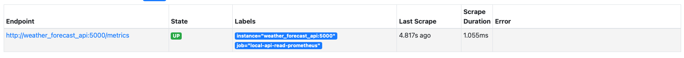
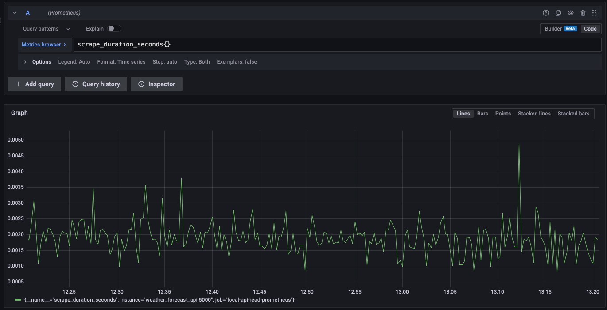
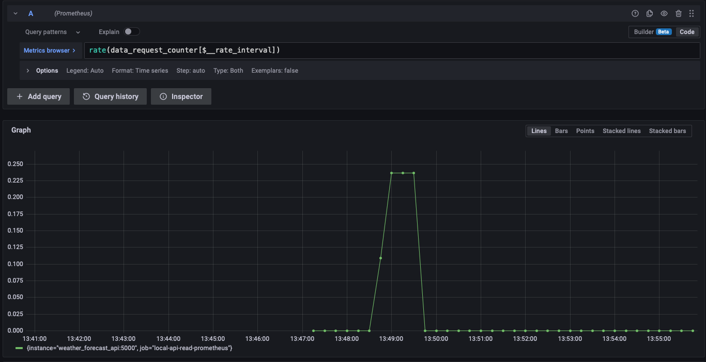
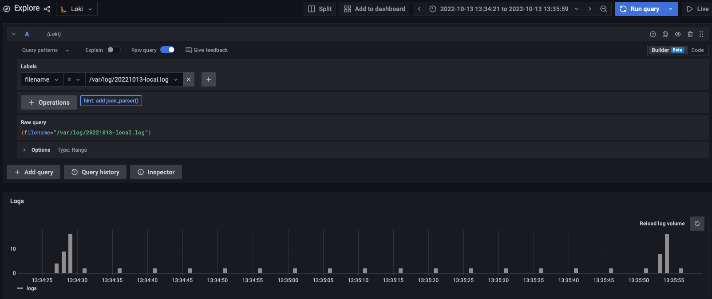
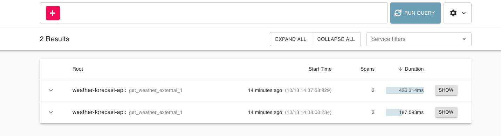
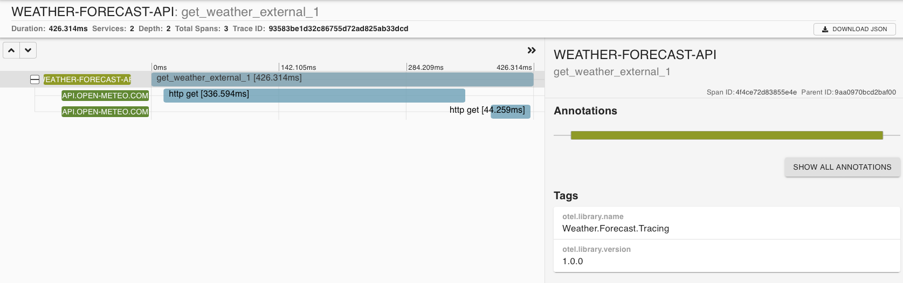
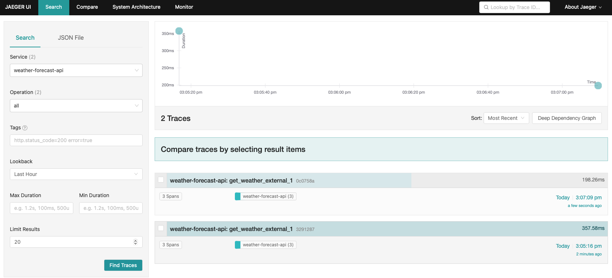
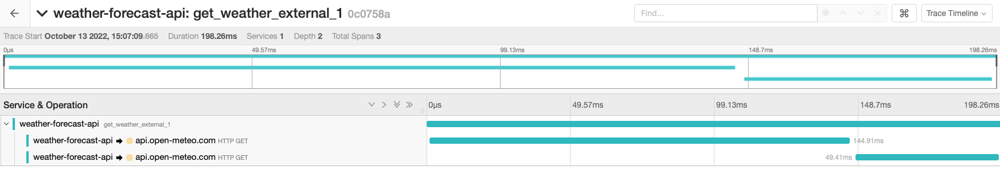

# Grafana-Data-Sources

***The current set up in this repo is very minimal. I am just touching the surface of what is possible. I wanted to demonstrate how to run the services locally***

### Build and run the api with docker on local port 4000
```shell
> docker build --pull --no-cache -t weather_forecast_api -f ops/docker/Dockerfile .
> docker run -p 4000:5000 --rm weather_forecast_api
```

You should now be able to view OTEL metrics from the API

```shell
> curl http://localhost:4000/metrics

# TYPE process_runtime_dotnet_gc_collections_count counter
# HELP process_runtime_dotnet_gc_collections_count Number of garbage collections that have occurred since process start.
process_runtime_dotnet_gc_collections_count{generation="gen2"} 0 1665568680770
process_runtime_dotnet_gc_collections_count{generation="gen1"} 0 1665568680770
process_runtime_dotnet_gc_collections_count{generation="gen0"} 0 1665568680770

.
.
.

# EOF
```

### Build and run the api with docker compose
Using docker compose, we can combine multiple docker containers into a single deployment.
These containers can communicate with each other since we can specify what network they can be added to.

First build the image
```shell
> docker build --pull --no-cache -t weather_forecast_api -f ops/docker/Dockerfile .
```
Then in the docker folder (`ops/docker`), run
```shell
> docker-compose up
```

Among other things, this will bring up Promethius. We have set Promethius up to scrape metrics from the `/metrics` endpoint of the weather forecaset API.
Notice in the `promethius.yml` file

```yaml
static_configs:      
      # replace the IP with your local IP for development
      # localhost is not it, as that is w/in the container :)
      - targets: ['weather_forecast_api:5000']
```

To confirm promethius can access the API metric scraping endpoint, browse to Browse to the [targets page](http://localhost:9090/targets). You should see 



Notice that the `Status` is `UP`

## Grafana set up
Browse to the [datasources page](http://localhost:3000/datasources)
### Promethius 
Set the URL to http://prometheus:9090 and then click `Save & Test`

Then go to the [explore page](http://localhost:3000/explore) and select promethius as the data source. You should be able to access the metrics 



#### Custom metrics
As an example, I have added a custom meter counter that we can use to track the number of requests made to `/WeatherForecast`

In `WeatherForecastController.cs` We have 

```csharp
SharedTelemetryUtilities.RequestCounter.Add(1);
```

This will add a new metric with a name we have specified `data.request_counter`
We can now view this custom metric in Grafana



### Loki
Set the URL to http://loki:3100 and then click `Save & Test`

Then go to the [explore page](http://localhost:3000/explore) and select loki as the data source. Under labels, select filename. You should have have a log file accessable.  



## Traces

In the endpoint `/WeatherForecast` I added some external calls to show traces in action. Once you make some calls to this endpoint, you will start to generate traces

### Zipkin 
Browse to [zipkin](http://localhost:9411) and click `RUN QUERY`. This should display some traces



Clicking one of these traces will give you more detail. As you can see, there is an over all request and the 2 external calls.



### Jaeger
Browse to [Jaeger](http://localhost:16686), select a service and click `Find Traces`. This should display some traces



Similar to Zipkin, clicking on one of the traces will give more detail



